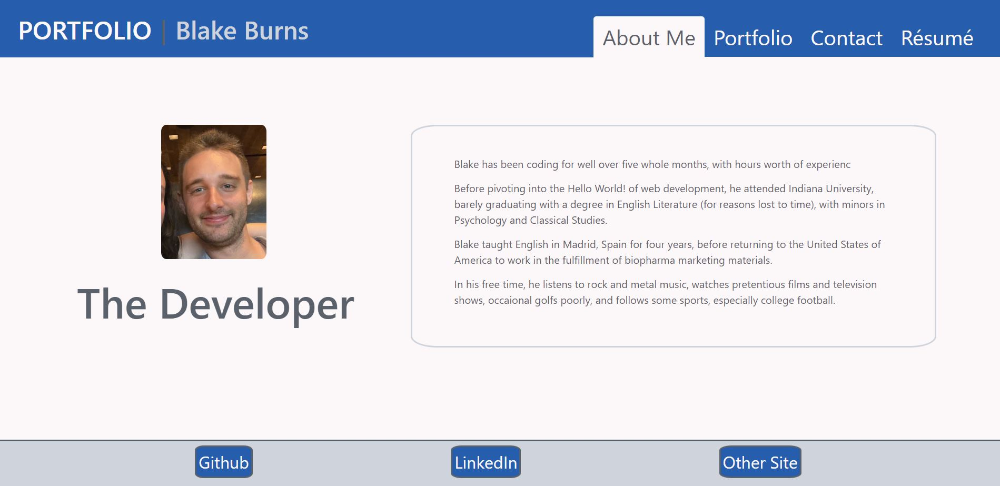

# React Portfolio
Module 20 Challenge: React

## Live Link
https://blakerichardburns.github.io/react-portfolio

## Repository Link
https://github.com/blakerichardburns/react-portfolio

## Description
Built specifically to test the developer's abilities with React, this portfolio also shows off the progression and development of his skills in web development, by linking various other projects completed for his coding bootcamp.

  ## Table of Contents
  * [Installation Instructions](#installation-instructions)
  * [Usage Information](#usage-information)
  * [Questions](#questions)

  ## Installation Instructions
  React.js

  ## Usage Information
  N/A

  ## Questions
  For any inquiries, spam by inbox here: blakerichardburns@gmail.com  
  To peruse more of my portfolio, check this out: [blakerichardburns](https://github.com/blakerichardburns)
